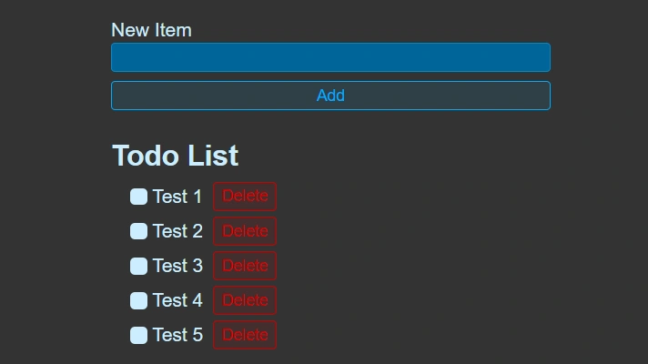

<div align="center">
    <a href="https://todolist-react-fv.netlify.app" target="_blank">
      
    </a>
  <h3 align="center">Todo List - React</h3>
</div>

##  <br /> 📋 <a name="table">Table of Contents</a>

- ✨ [Introduction](#introduction)
- ⚙️ [Tech Stack](#tech-stack)
- 📝 [Features](#features)
- 🚀 [Quick Start](#quick-start)

##  <br /> <a name="introduction">✨ Introduction</a>

**[EN]** A simple to-do list built from scratch using React, incorporating local storage to persist data. This project breaks down key React concepts and practices, offering a hands-on approach to understanding the fundamentals of React development. 

**[FR]** Une simple liste de tâches construite de zéro avec React, utilisant le local storage pour conserver les données. Ce projet décompose les concepts clés de React et les pratiques importantes, offrant une approche pratique pour comprendre les fondamentaux du développement React. 

##  <br /> <a name="tech-stack">⚙️ Tech Stack</a>

- **React** is a popular JavaScript library for building user interfaces, particularly single-page applications where data changes over time. React's component-based architecture allows developers to create reusable UI components, making development more efficient and the codebase easier to maintain. 

- **Vite** is a modern front-end build tool that offers a fast and efficient development environment. It leverages ES modules for quick build times and features hot module replacement (HMR) for instant updates, making it ideal for frameworks like React, Vue, and Svelte. Vite's minimal configuration helps streamline development workflows.

- **Local Storage** is a web storage feature that allows web applications to store data persistently in the user's browser. It provides a simple key-value store with a straightforward API, enabling developers to save data across browser sessions without expiration. Local Storage is ideal for storing user preferences, session data, and other non-sensitive information. Its synchronous API makes it easy to use, though it is limited to storing string data only and has a size limit of around 5MB per domain.

## <br /> <a name="quick-start">🚀 Quick Start</a>

Follow these steps to set up the project locally on your machine.

<br/>**Prerequisites**

Make sure you have the following installed on your machine:

- [Git](https://git-scm.com/)
- [Node.js](https://nodejs.org/en)
- [npm](https://www.npmjs.com/) (Node Package Manager)

<br/>**Cloning the Repository**

```bash
git clone {git remote URL}
```

<br/>**Installation**

Let's install the project dependencies, from your terminal, run:

```bash
npm install
# or
yarn install
```

<br/>**Running the Project**

Installation will take a minute or two, but once that's done, you should be able to run the following command:

```bash
npm run dev
# or
yarn dev
```

Open [`http://localhost:5173`](http://localhost:5173) in your browser to view the project.